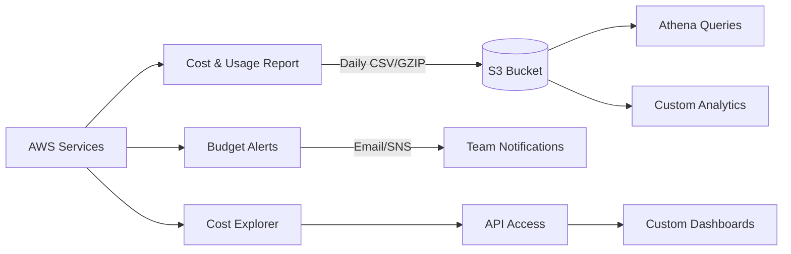
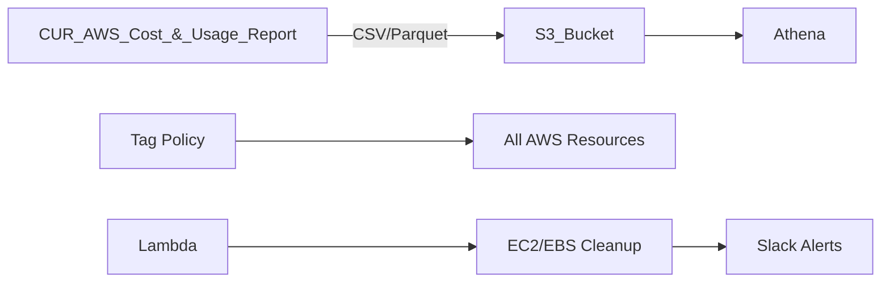

# AWS Cost Optimization Toolkit 

A comprehensive solution to reduce AWS costs through automated resource cleanup, tagging enforcement, and cost visibility.

##  Projects Overview

### 1. **Orphaned EBS Volume Cleanup** 
**Technology**: AWS Lambda (Python) + IAM  
**Purpose**: Automatically identifies and deletes unattached EBS volumes and their snapshots  
**Key Features**:
- Checks volume attachment status daily
- Validates snapshots before deletion
- Maintains audit trail of deleted resources
- Whitelisting capability for protected resources

### 2. **Tag Enforcement Policy**
**Technology**: Terraform + AWS Config  
**Purpose**: Enforces mandatory tagging compliance across all AWS resources  
**Key Features**:
- Requires `Owner`, `CostCenter`, `Environment` tags
- Auto-remediates non-compliant resources
- Integrates with AWS Organizations
- Email notifications for non-compliant resources

### 3. **Cost Visibility Pipeline** 
**Technology**: AWS CUR + Athena + Terraform  
**Purpose**: Provides granular cost analysis and reporting  
**Key Features**:
- Daily Parquet-formatted CUR reports
- Athena SQL interface for cost queries
- Automated S3 storage lifecycle
- Pre-built Grafana dashboards

## 4. **Automated Cost Reporting & Budgeting** 
**Technology**: AWS CUR + Budgets + Cost Explorer  
**Purpose**: Provides automated cost tracking and budget alerts  
**Key Features**:
- Daily cost reports in S3 (CSV/GZIP format)
- Monthly budget thresholds with email alerts
- Cost Explorer API access via IAM role
- Historical cost data retention

## 🛠️ Architecture

 Deployment
Prerequisites
AWS Account with billing access

Terraform v1.0+

AWS CLI configured

Python 3.9+ (for Lambda development)

# Clone repository
git clone https://github.com/your-repo/aws-cost-optimization.git
cd aws-cost-optimization

# Initialize Terraform
cd terraform/
terraform init

# Deploy infrastructure (review plan first)
terraform plan 
terraform apply 

## Security

Least-privilege IAM roles

S3 encryption at rest (AES-256)

AWS Config rules for continuous compliance

CloudTrail logging for all actions

## Monitoring & Alerts
CloudWatch Dashboards for cost trends

Slack Notifications for cleanup actions

Weekly Email Reports (via Amazon SES)

## Best Practices Implemented
Resource tagging standardization

Automated cleanup of unused resources

Cost anomaly detection

Infrastructure-as-Code (Terraform)

Documentation-driven development

## License
Distributed under the MIT License. See LICENSE for more information.

